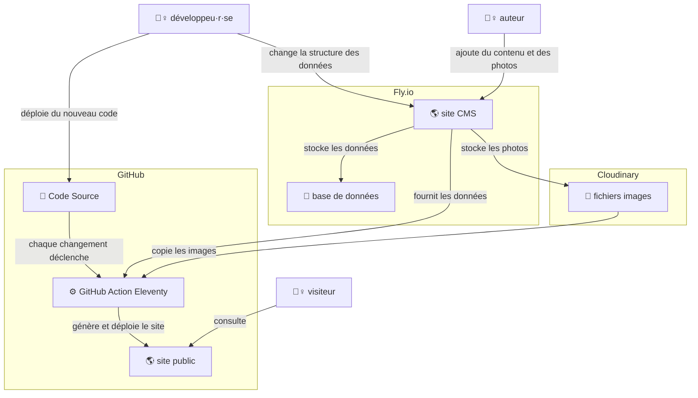

# Atlas-T

## Architecture

- [atlas-t.fr](https://www.atlas-t.fr) : le site public
- [atlas-t.fly.dev/admin](https://atlas-t.fly.dev/admin) : site pour gérer le contenu (via Strapi)



## Local

- `cp strapi/.env.example strapi/.env` et configurez les variables d'environnement

- `make strapi-install` : installation de strapi et de ses dépendances
- `make strapi-dev` : serveur strapi local
- `make strapi-deploy` : deploiement de strapi vers fly.io

## Détails de la config du déploiement de Strapi sur Fly.io

Commencez par vous déplacer dans le repo strapi : `cd strapi`

Puis lancez un deploy ce qui devrait créer l’app Fly.io et la machine associée
```sh
fly deploy
```

Associez-y un volume :

```sh
fly volumes create atlas_t_data
```

Puis définissez les variables d’environnement nécessaires :

```sh
fly secrets set APP_KEYS=$(openssl rand -base64 32) \
  API_TOKEN_SALT=$(openssl rand -base64 32) \
  ADMIN_JWT_SECRET=$(openssl rand -base64 32) \
  JWT_SECRET=$(openssl rand -base64 32) \
  NODE_ENV=production \
  DATABASE_CLIENT=sqlite \
  DATABASE_PATH=/data/atlas-t.db \
  CLOUDINARY_NAME=outofscreen \
  CLOUDINARY_KEY=123456789 \
  CLOUDINARY_SECRET=abc1234def \
  GITHUB_TOKEN=github_pat_BLABLA1234
```

Enfin ajoutez de la mémoire à la machine pour éviter les crashes lors de l’upload de photos

```sh
fly machine update --vm-memory 1024
```
