# Atlas.t

## TODO

- le cropping des images
- nouvelle police pour le titre uniquement - Yasmine envoie
- nouveau contenu portfolio PDF + lien pour télécharger. si trop compliqué, lien vers le PDF hébergé déjà existant
- Cartes de visite en photo avec le(s) numéros de tél sur la page contact

## Architecture

- [atlas-t.fr](https://www.atlas-t.fr) : le site public
- [atlas-t.fly.dev/admin](https://atlas-t.fly.dev/admin) : site pour gérer le contenu (via Strapi)

```mermaid
flowchart TD
  subgraph GitHub
    code["📁 Code Source"]
    ghaction["⚙️ GitHub Action Eleventy"]
    www["🌎 site public"]
  end
  subgraph Fly.io
    strapi["🌎 site CMS"]
    db["📁 base de données"]
  end
  subgraph Cloudinary
    images["📁 fichiers images"]
  end
  dev["🙋‍♀️ développeu·r·se"]
  auteur["🙋‍♀️ auteur"]
  visiteur["🙋‍♀️ visiteur"]

  dev -- déploie du nouveau code --> code
  dev -- change la structure des données --> strapi

  auteur -- ajoute du contenu et des photos --> strapi
  strapi -- stocke les données --> db
  strapi -- stocke les photos --> images

  code -- chaque changement déclenche --> ghaction
  ghaction -- génère et déploie le site --> www
  strapi -- fournit les données --> ghaction
  images -- copie les images --> ghaction

  visiteur -- consulte --> www
```



## Local

- `cp strapi/.env.example strapi/.env` et configurez les variables d'environnement

- `make strapi-install` : installation de strapi et de ses dépendances
- `make strapi-dev` : serveur strapi local
- `make strapi-deploy` : deploiement de strapi vers fly.io

## Détails de la config du déploiement de Strapi sur Fly.io

Commencez par vous déplacer dans le repo strapi : `cd strapi`

Puis lancez un deploy ce qui devrait créer l’app Fly.io et la machine associée

```sh
fly deploy
```

Associez-y un volume :

```sh
fly volumes create atlas_t_data
```

Puis définissez les variables d’environnement nécessaires :

```sh
fly secrets set APP_KEYS=$(openssl rand -base64 32) \
  API_TOKEN_SALT=$(openssl rand -base64 32) \
  ADMIN_JWT_SECRET=$(openssl rand -base64 32) \
  JWT_SECRET=$(openssl rand -base64 32) \
  NODE_ENV=production \
  DATABASE_CLIENT=sqlite \
  DATABASE_PATH=/data/atlas-t.db \
  CLOUDINARY_NAME=outofscreen \
  CLOUDINARY_KEY=123456789 \
  CLOUDINARY_SECRET=abc1234def \
  GITHUB_TOKEN=github_pat_BLABLA1234
```

Enfin ajoutez de la mémoire à la machine pour éviter les crashes lors de l’upload de photos

```sh
fly machine update --vm-memory 1024
```

## Configuration de GitHub Pages

- Activez l’origine « Github Actions » dans l’onglet Pages
- Dans le menu gauche « Secrets and Variables > Actions » ajoutez les deux variables d’environnement `STRAPI_API_URL` et `STRAPI_API_TOKEN`. Pour ce dernier, créez un token depuis l’interface web de strapi en prod.
